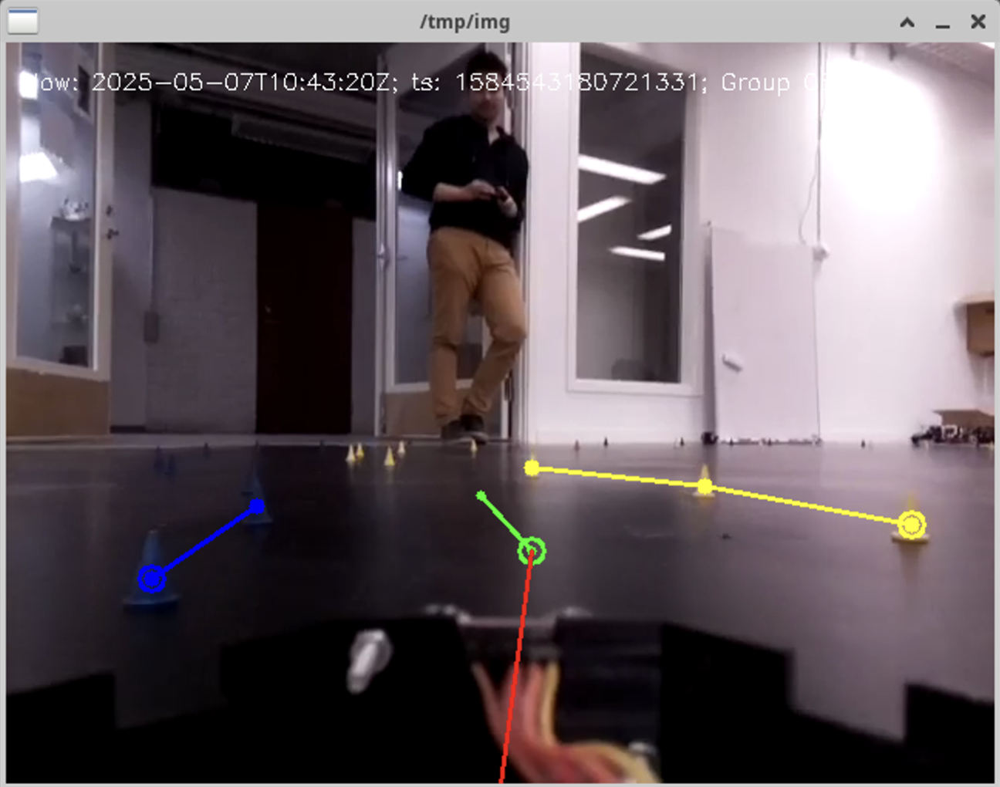
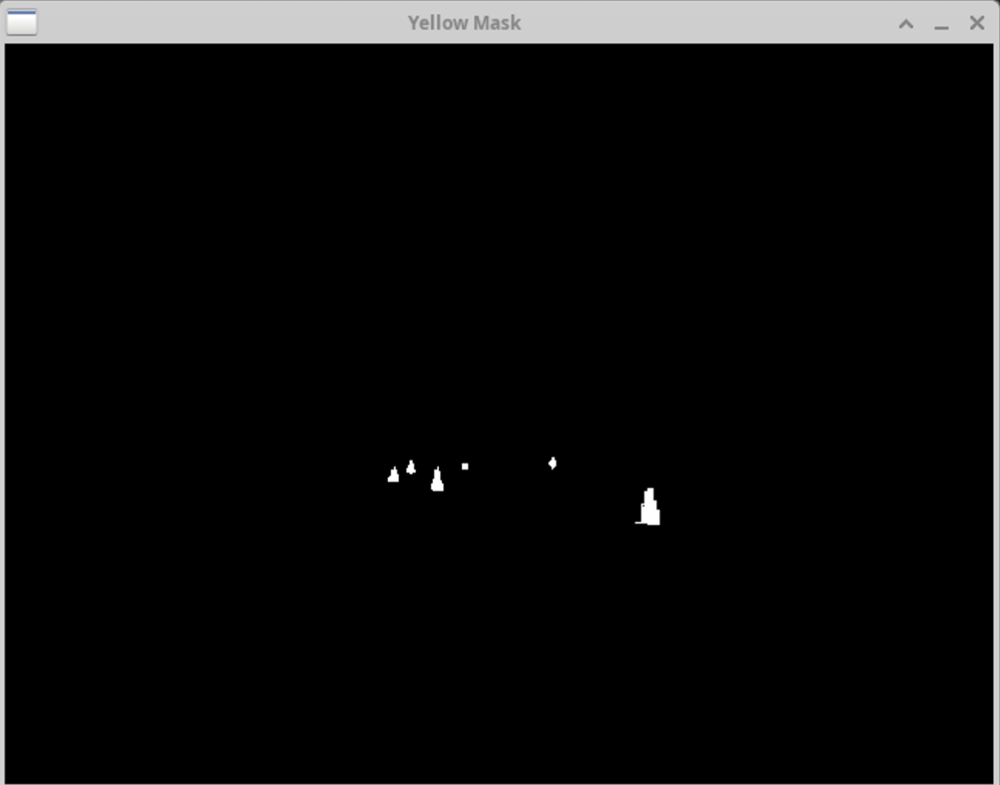
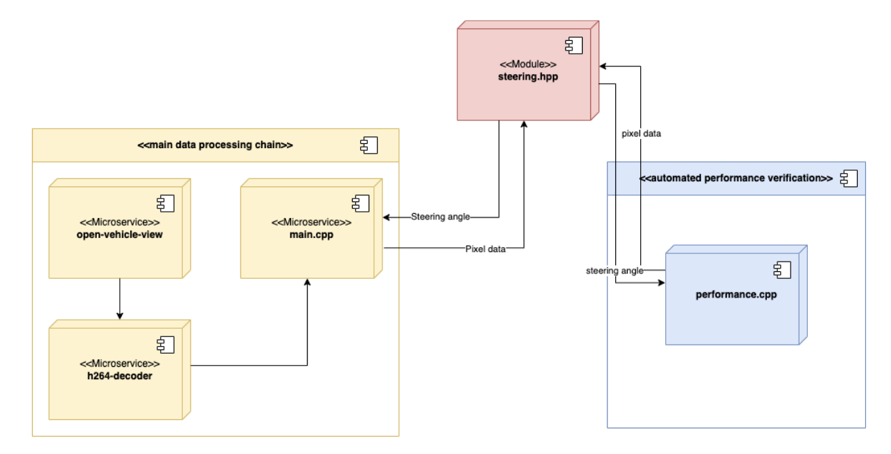

# Cortex Cruiser – A Self-Driving Prototype in Action


## Description
Cortex Cruiser is a self-driving car prototype project developed for the course DIT639: Cyber-Physical Systems and System of Systems at the University of Gothenburg. The system detects cones in video recordings and computes steering angles in real time, supported by an automated performance testing pipeline.

#### Snapshot of the application running



### Overview

The project combines computer vision, modular architecture, and automated testing to simulate autonomous driving. At its core, the system uses OpenCV to identify cones from track footage, estimates the center path, and calculates steering angles accordingly.

To evaluate the algorithm, we built a dedicated performance testing application that runs on recorded data, outputs results to CSV, and generates plots to visualize accuracy across different commits. This tool is integrated into a CI/CD pipeline, ensuring that improvements are continuously validated.

#### Example of image mask that detects yellow cones



### Architecture

The system is organized into three parts:

1. Main Data Processing Chain – microservices that process recordings and simulate car behavior.

2. Steering Module – encapsulates the cone-based algorithm, designed for easy modification.

3. Performance Testing Tool – a standalone program that automates accuracy checks and feeds results into the CI/CD pipeline.

#### Architecture Diagram


### Steering Algorithm

Our algorithm relies solely on video input. Each frame is converted to HSV color space, cones are isolated through color masks, and centroids are calculated for path estimation. The steering angle is then derived from the offset between the image center and the estimated track center.
Fallback methods ensure robustness when cones are missing, though in practice the system almost always relies on historical centroids from previous frames.

### Development Process

We worked collaboratively, with each assignment milestone serving as a checkpoint. Tools like GitLab issues, branches, and CI pipelines supported our workflow. Large Language Models were also used to accelerate tasks such as script generation, debugging, and pipeline setup — particularly useful in areas where we had little prior experience.

## Requirements & Dependencies

### Preqrequisites
- The project assumes a Linux based operating system such as Ubuntu. 
The tools required to be installed on the system are:
    - g++ 
        - Any version
    - cmake
        - Version 3.2+
    - make
        - Any version
    - Docker
        - Latest version
    - wget
        - Any version
    - git
        - Any version

## How to install these tools
    - g++: sudo apt-get install build-essential
    - cmake: sudo apt-get install cmake
    - make: included in build essential
    - Docker: https://docs.docker.com/get-docker/
    - wget: sudo apt-get install wget
    - git: sudo apt-get install git
## Required files
* catch.hpp (used for testing)
    - download: https://github.com/catchorg/Catch2/releases/download/v2.13.10/catch.hpp)


## Cloning the repository
Open a terminal and change directory to where you want to store the repository, for example desktop.
```
mkdir dit639
cd dit639
git clone git@git.chalmers.se:courses/dit638/students/2025-group-06.git
```

Note: The original repository was hosted on GitLab and is no longer available

## Building and excecuting in the terminal
This project uses cmake for building files. To build a file you navigate to the location of the file you want to build.
```
cd example/example.cpp
```

#### First build

```
mkdir build
cd build
cmake ..
make
```

#### When building again

```
cd build
rm -f *    #CHECK THAT YOU ARE IN THE RIGHT FOLDER!!!!
cmake ..
make
```

After you have built the file, the file is now excecutable. Make sure you are in the build folder. To excecute the file run

```
./example "arguments" 
```

## Authors and acknowledgment
- Martin Lidgren
- Edvin Sanfridssson 
- Love Carlander Strandäng
- Erik Nisbet

